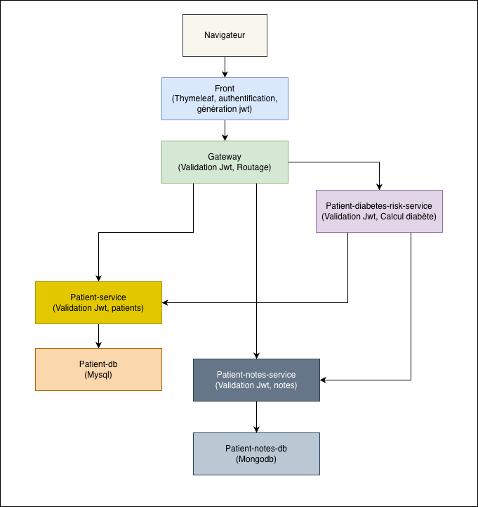

# Medilabo Solutions
Plateforme de dépistage des risques de maladies pour cliniques de santé et cabinets privés.

# Présentation
Medilabo est une application web développée pour une société internationale
travaillant avec des cliniques de santé et des cabinets privés sur le dépistage des risques de maladies.

Elle permet de gérer les dossiers patients et les notes médicales associées, dans une architecture microservices moderne.

# Architecture

# Microservices
- Front (Interface utilisateur Thymeleaf)
- Gateway (Point d'entrée, routage)
- patient-service (Gestion des patients)
- patient-db (base de données patients)
- patient-notes-service (Notes médicales sur les patients)
- patient-notes-db (Base de données notes)
- patient-diabetes-risk-service (Calcul du risque de diabète du patient)

# Variables d'environnement
Fichier .env

# Compiler les microservices
Depuis le dossier racine lancer la commande:
mvn clean package

# Lancer l'application
docker compose up --build

# Utilisation
Une fois les services démarrés, accédez à l'application depuis l'adresse suivante:
http://localhost:8081

# Identifiants de connexion
Utilisateur : user 

Mot de passe : 1234

# Fonctionnalités
- Consulter la liste des patients
- Ajouter un patient
- Modifier un patient
- Consulter le détail d'un patient avec ses notes médicales
- Ajouter une note médicale pour un patient

# Sécurité
L'authentification est gérée par le microservice front à l'aide de Spring Security.
Il génère un token Jwt qui est transmis à la gateway par l'intermédiaire d'un cookie.

La gateway vérifie la validité du token et le transmet aux autres services back.

Chaque service back vérifie à son tour la validité du token.

# Green code
Le but du green code est de réduire l'empreinte énergétique en appliquant de bonnes pratiques de code.

Voici les actions que l'on peut mettre en place :
 - Utiliser des algorithmes efficaces et éviter les complexités inutiles
 - Utiliser des structures de données adaptées
 - Favoriser les endpoints précis pour éviter les transferts de données massifs
 - Paginer les listes
 - Utiliser des caches pour les résultats récurrents
 - Limiter le nombre de logs en production
 - Favoriser les microservices légers et découplés

Il existe des outils pour mesurer l'efficacité énergétique du code :
- Scaphandre : mesure la consommation énergétique du code
- EcoCode : linter orienté sobriété énergétique du code
